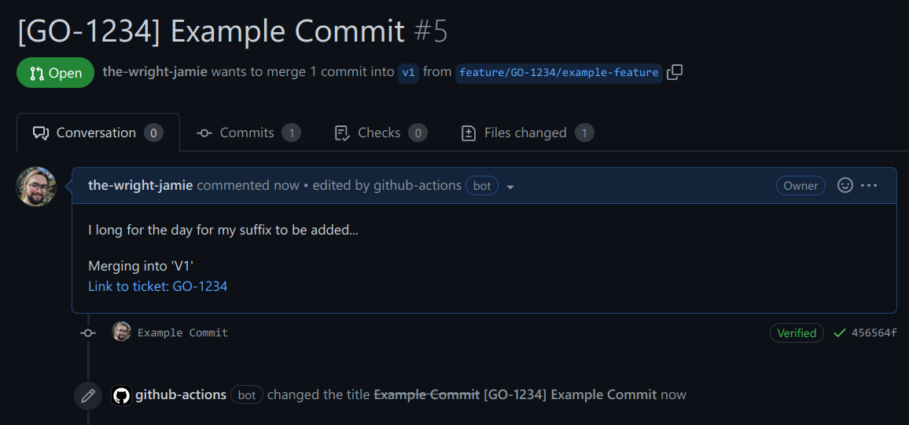

# Pull Request Updater


[](https://github.com/the-wright-jamie/update-pr-info-action/releases/latest)

This is a GitHub Action that updates a pull request with information extracted from the head and/or base branch name. The pull request title and body can either have the extracted information prefixed or suffixed, or have them be replaced by the information entirely.

## Usage

Create a workflow `yaml` file (e.g. `.github/workflows/update-pr.yml`). See [Creating a Workflow file](https://docs.github.com/en/actions/learn-github-actions/understanding-github-actions#create-an-example-workflow) on the GitHub Docs.

### Inputs

#### Required

- `repo-token`: secret token to allow making calls to GitHub's rest API (for e.g. `${{ secrets.GITHUB_TOKEN }}`)

#### Optional

- `base-branch-regex`: regex to match text from the base branch name
- `head-branch-regex`: regex to match text from the head branch name
- `lowercase-branch`: whether to lowercase branch name internally before matching (default: `true`)
- `title-template`: text template to update title with
- `title-update-action`: whether to prefix, suffix or replace title with the `title-template` (default: `prefix`)
- `title-insert-space`: whether to insert a space between title and its prefix or suffix (default: `true`)
- `title-uppercase-base-match`: whether to make the matched text from the base branch uppercase in the title (default: `true`)
- `title-uppercase-head-match`: whether to make the matched text from the head branch uppercase in the title (default: `true`)
- `body-template`: text to insert into the PR body. You can use whatever text you like, along with the following tokens: `%basebranch%` | `%headbranch%`
- `body-update-action`: whether to prefix, suffix or replace body with `body-template` (default: `prefix`)
- `body-newline-count`: number of newlines to separate body and its prefix or suffix (default: `2`)
- `body-uppercase-base-match`: whether to make the matched text from the base branch uppercase in the body (default: `true`)
- `body-uppercase-head-match`: whether to make the matched text from the head branch uppercase in the body (default: `true`)

## Notes

- A value for at least one of `base-branch-regex` or `head-branch-regex` should be provided, otherwise the action will return an error. The value should be a [JavaScript Regular Expression](https://developer.mozilla.org/en-US/docs/Web/JavaScript/Guide/Regular_Expressions).
- `title-template` and `body-template` can contain any text that you like, along with any of the following tokens (which can be repeated if required) which will be replaced by the matched text from branch name:
  - `%basebranch%`
  - `%headbranch%`
- `title-update-action` and `body-update-action` can be set to one of the following values:
  - `prefix`
  - `suffix`
  - `replace`
- `body-template` can be set to a GitHub secret if necessary to avoid leaking sensitive data. `body-template: ${{ secrets.PR_BODY_TEMPLATE }}`

## Outputs

- `baseMatch`: matched text from base branch if any
- `headMatch`: matched text from head branch if any
- `titleUpdated`: whether the PR title was updated
- `bodyUpdated`: whether the PR body was updated

## Example

This sample `yaml`:

```yaml
name: "Update Pull Request"
on: pull_request

jobs:
  update_pr:
    runs-on: ubuntu-latest
    steps:
      - uses: the-wright-jamie/update-pr-info-action@v1
        with:
          repo-token: "${{ secrets.GITHUB_TOKEN }}"
          base-branch-regex: '[a-z\d-_.\\/]+'
          head-branch-regex: 'foo-\d+'
          title-template: "[%headbranch%] "
          body-template: |
            Merging into '%basebranch%'
            [Link to %headbranch%](https://url/to/browse/ticket/%headbranch%)
          body-update-action: "suffix"
          body-uppercase-base-match: false
```

produces the following effect... :point_down:

### Before


### After


